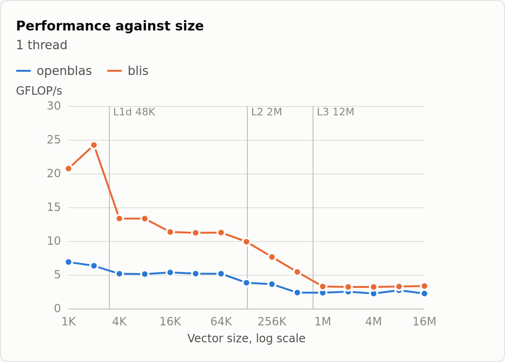
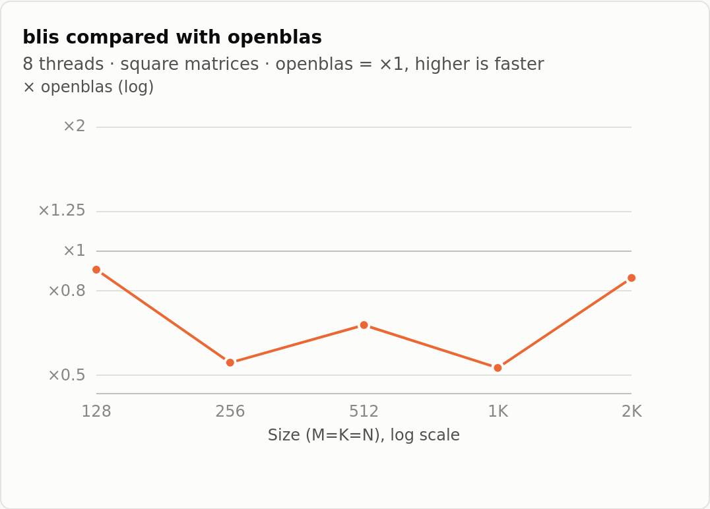
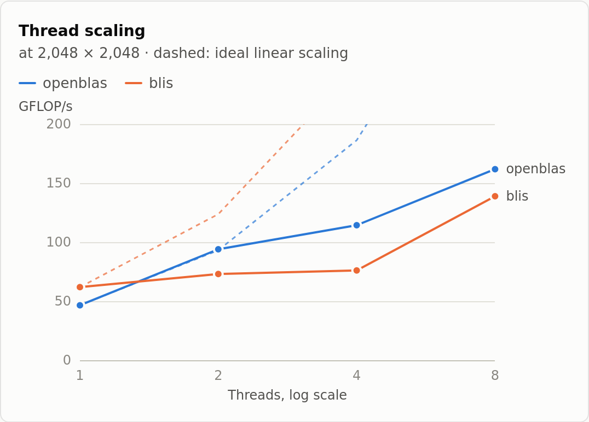
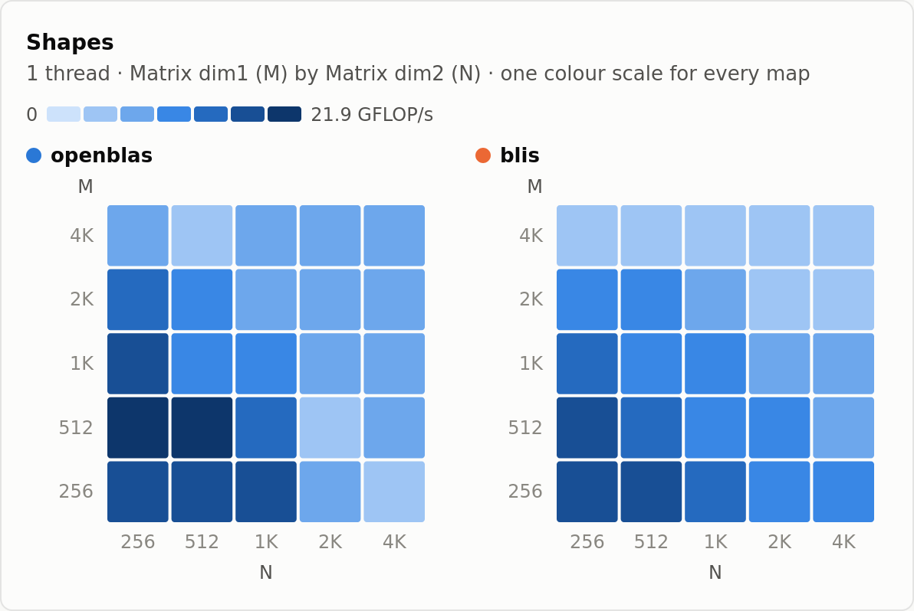

# blas-microbenchmark

[](https://github.com/MathieuCAISSA/blas-microbenchmark/actions/workflows/ci.yml)
[](LICENSE)

Command-line microbenchmarks for BLAS routines: one small executable per
routine, the same options for all of them, and results in text, CSV or
JSON — [osu-micro-benchmarks](https://mvapich.cse.ohio-state.edu/benchmarks/),
but for BLAS instead of MPI.

Build it against OpenBLAS, BLIS, Netlib reference BLAS, NVPL or ArmPL, run
the same commands on each, and compare them on one page of charts.

## Install

You need a C compiler (GCC ≥ 12) and a BLAS library — at minimum OpenBLAS
(`libopenblas-dev` on Debian/Ubuntu). Take
**`blas-microbenchmark-<version>.tar.gz`** from the
[latest release](https://github.com/MathieuCAISSA/blas-microbenchmark/releases/latest):

```bash
tar xf blas-microbenchmark-<version>.tar.gz
cd blas-microbenchmark-<version>
./configure            # --prefix=DIR to install elsewhere than /usr/local
make
make check
make install
```

From a git clone, run `./autogen.sh` first (it needs autoconf, automake
and libtool); GitHub's *"Source code"* archives are git clones too.

The benchmarks install by BLAS level under
`/usr/local/libexec/blas-microbenchmark`, not on the `PATH`. To run them by
name:

```bash
BMB=/usr/local/libexec/blas-microbenchmark
export PATH="$BMB/level1:$BMB/level2:$BMB/level3:$PATH"
```

On a cluster, `configure` finds a BLAS loaded with `module load` through
the variables the module sets (`OPENBLAS_ROOT`, `BLIS_INCDIR`,
`ARMPL_LIBDIR`, …); otherwise point at it with `--with-blas-incpath=DIR`
and `--with-blas-libpath=DIR`.

## Quick start

```
$ bmb_dgemm -m 512:2048
# blas-microbenchmark 1.0.0
# backend: openblas (OpenBLAS 0.3.26 NO_LAPACKE DYNAMIC_ARCH NO_AFFINITY Haswell MAX_THREADS=64)
# cpu: Intel(R) Core(TM) Ultra 7 155U (14 logical CPUs, 1 NUMA node)
# caches: L1d 48K, L1i 64K, L2 2M, L3 12M
# os: Linux 6.6.87.1-microsoft-standard-WSL2 x86_64
# date: 2026-10-03T14:17:36Z
# routine: dgemm
Thread count    Matrix dim1 (M=K)   Matrix dim2 (N)     time [s]        GFLOP/s
1               512                 512                 0.005819348     46.128
1               1024                1024                0.051711211     41.528
1               2048                2048                0.367186671     46.788
```

There are 20 benchmarks, `bmb_<routine>`, covering levels 1 to 3:
`dasum` `daxpy` `dcopy` `ddot` `dnrm2` `dscal` `dswap`, `dgemv` `dger`
`dsymv` `dsyr` `dsyr2` `dtrmv` `dtrsv`, `dgemm` `dsymm` `dsyrk` `dsyr2k`
`dtrmm` `dtrsm`. They all take the same options: sizes to sweep
(`-v`, `-m`, `-M`), thread counts (`-t`), a file to save to (`-o`).
`bmb_dgemm --help` lists them, and
**`man blas-microbenchmark`** explains everything: sweeps, how a number is
measured, threads and NUMA, the output formats.

## Charts: `bmb_report`

```bash
bmb_ddot  -v 1024:16777216           -o results/ddot-openblas.json
bmb_dgemm -m 128:2048 -t 1:8         -o results/dgemm-openblas.json
bmb_dgemv -m 256:4096 -M 256:4096    -o results/dgemv-openblas.json
# ... the same three from a build against BLIS, as *-blis.json
bmb_report results/*.json > report.html
firefox report.html
```

The page is a single self-contained file — nothing is fetched, so it opens
without a network and can be sent as is. It shows performance against
size with the caches marked, each library compared with OpenBLAS, thread
scaling, a heatmap for sweeps over both dimensions, and the raw data;
`man bmb_report` has the details.

<p>
<picture>
  <source media="(prefers-color-scheme: dark)" srcset="doc/images/ddot-size-dark.png">
  
</picture>
<picture>
  <source media="(prefers-color-scheme: dark)" srcset="doc/images/dgemm-ratio-dark.png">
  
</picture>
<picture>
  <source media="(prefers-color-scheme: dark)" srcset="doc/images/dgemm-threads-dark.png">
  
</picture>
<picture>
  <source media="(prefers-color-scheme: dark)" srcset="doc/images/dgemv-shapes-dark.png">
  
</picture>
</p>

*The commands above, run on a laptop (Intel Core Ultra 7 155U, WSL2)
against OpenBLAS 0.3.26 and BLIS 0.9.0: what the page draws, not a verdict
on either library.*

## Backends

Chosen when building, and each one built and tested in CI:

| Backend | `configure` flag |
| --- | --- |
| OpenBLAS *(default)* | *(none)* |
| BLIS | `--with-blas-backend=blis` |
| Netlib reference | `--with-blas-backend=netlib` |
| NVPL *(aarch64)* | `--with-blas-backend=nvpl` |
| ArmPL *(aarch64)* | `--with-blas-backend=armpl` |

## Documentation

The manual pages, also online at
**[mathieucaissa.github.io/blas-microbenchmark](https://mathieucaissa.github.io/blas-microbenchmark/)**:

- `man blas-microbenchmark` (also `man bmb_dgemm`, and so on) — the
  benchmarks.
- `man bmb_report` — the report.
- Before installing, from the build directory: `man -l man/blas-microbenchmark.1`.
- [AGENTS.md](AGENTS.md) — for contributors: building from git, the tests,
  adding a routine, CI.

## License

[Apache License 2.0](LICENSE).
